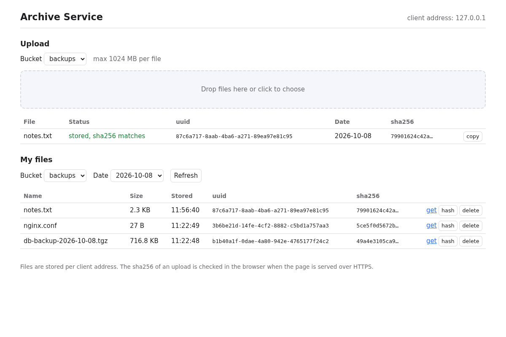

# Web UI

A simple web page to upload files and browse your own files, served by the
service at `/ui/`. It is **off by default**.



## Turn it on

Set `ARCHIVE_UI=true`, eg. with docker compose:

```
ARCHIVE_UI=true docker compose up -d
```

and open `http://<server>:8080/ui/` (or `https://` with TLS).

## What it does

* **Upload** - choose a bucket, then drop files on the page or click to
  choose them. Each upload shows its progress and then the uuid, date and
  sha256, the **copy** button copies them.
* **sha256 check** - the browser calculates the sha256 of the file itself and
  compares it with the one the server returns: *stored, sha256 matches*. The
  browser only allows this when the page is served over **HTTPS** (or from
  `localhost`), and files larger than 256 MB are not checked as the whole
  file has to be read into memory. The page says when the check was skipped.
* **My files** - choose a bucket and a date to see the files stored then, with
  their original name, size and time. **get** downloads a file under its
  original name, **hash** asks the server for the sha256 again and compares it
  with the one from when the file was stored, **delete** is only shown when
  the server allows deleting (`ARCHIVE_ALLOW_REMOVE=true`).

The page shows the **client address** the server sees, files are stored per
client address. A laptop that moves to another network gets another address
and does not see the files stored from the old one. Browsers on the Docker
host all get the Docker gateway address, see [Configuration](configuration.md#client-address-and-reverse-proxies).

## Client certificates in the browser

When the server requires client certificates (see [TLS](tls.md)) the browser
must have the client certificate and key. Browsers import them as a PKCS#12
file (`.p12`), which also holds the CA:

```
openssl pkcs12 -export -name "archive client" \
  -in client.crt -inkey client.key -certfile ca.pem \
  -out client.p12
```

openssl asks for a password to protect the file, the browser asks for it when
importing. (Older macOS versions can't read the default encryption, add
`-legacy` for them.)

Import the `.p12`:

* **Firefox** - Settings → Privacy & Security → Certificates → View
  Certificates. Import the `.p12` under *Your Certificates*, and import the CA
  (`ca.pem`) under *Authorities* with "trust this CA to identify websites" if
  the server certificate is from your own CA.
* **Chrome / Chromium on Linux** - Settings → Privacy and security → Security
  → Manage certificates. Import the `.p12` under *Your certificates* and the
  CA under *Authorities*.
* **Chrome and Edge on Windows, Safari and Chrome on macOS** use the system
  certificate store: open the `.p12` (Windows: certificate import wizard,
  macOS: Keychain Access) and trust the CA.

When the page is opened the browser asks which certificate to use.

For testing, `conf/test-certs/archive-client.test.gazonk.se.p12` has the test
client certificate and the test CA, the password is `archive-test`.

## Security

* Only the files of your own client address can be seen, like with the
  [client](client.md).
* The page is three static files (`app/static/ui/`) calling the JSON
  [API](api-doc.md). No inline scripts or styles, so the server's
  `Content-Security-Policy` only allows the page's own files, and file names
  are always shown as text.
* Browsers send the client certificate to any site that asks, so another web
  site could try to make your browser upload or delete files. The server
  refuses requests that change data when the browser says they come from
  another site (the `Origin` header).
